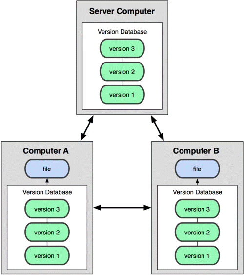
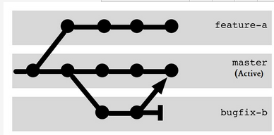
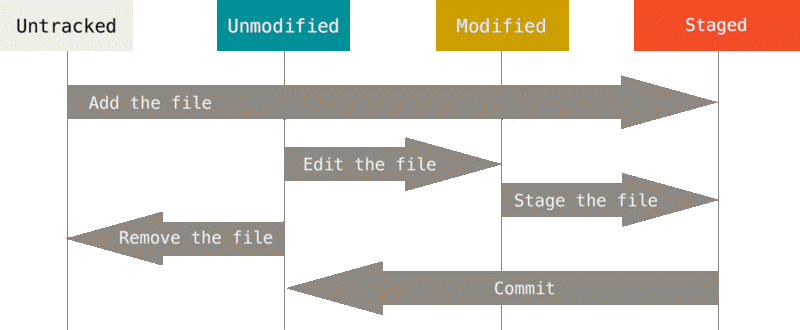
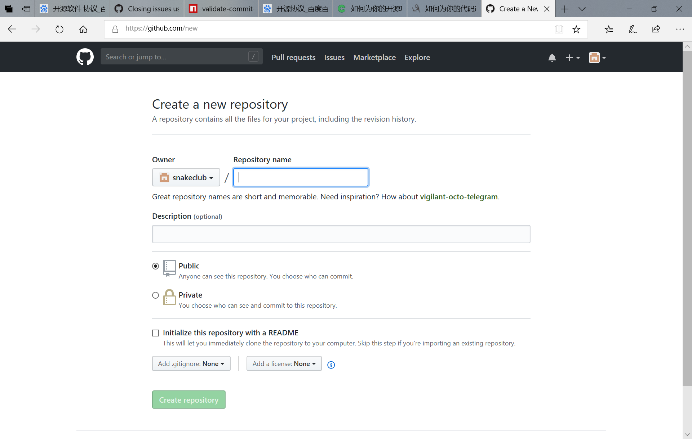

# Git入门介绍

## 工具简介

Git是一个版本控制系统（Version Control System，VCS），用于记录一个或若干文件内容变化，以便将来查阅特定版本修订情况。与SVN等集中式版本控制系统（服务器保存版本库，客户端仅保留最新代码）不同，Git是分布式版本控制系统，客户端并不只提取最新版本的文件快照，而是把代码仓库完整地镜像下来，这样当任何一处协同工作用的服务器发生故障，事后都可以用任何一个镜像出来的本地仓库恢复。

Git的版本控制原理如下： 



官网：<https://git-scm.com/>

Pro Git在线文档：<https://git-scm.com/book/zh/v2>

Github是在线的基于Git的代码托管服务，GitHub同时提供付费账户和免费账户。这两种账户都可以创建公开的代码仓库，但是付费账户也可以创建私有的代码仓库。

官网：<https://github.com/>

GitLab是一个自托管的Git项目仓库，可以通过web界面进行访问公开的或者私人项目，拥有与GitHub类似的功能，能够浏览源代码，管理缺陷和注释，可以管理团队对仓库的访问。一般用于在企业内搭建git私服，git-ce是社区版，gitlab-ee是企业版，收费版。

官网：<https://about.gitlab.com/>

Github和GitLab的主要差异是：Github只提供基于互联网的代码托管服务，对于免费用户只能创建公开代码仓库，因此更适合进行开源项目的代码托管；GitLab支持自行搭建内网的代码托管Web服务，适合企业内部的团队使用。

## 基本概念

### 版本仓库

- **项目版本库（blessed repository）**：该版本库主要用于存储由“官方”创建并发行的版本。
- **共享版本库（shared repository）**：该版本库主要用于开发团队内人员之间的文件交换。在小型项目中，项目版本库本身就可以胜任这一角色了。但在多点开发的条件下，我们可能就会需要几个这样的专用版本库。
- **工作流版本库（workflow repository）**：工作流版本库通常只用于填充那些代表工作流中某种特定进展状态的修改，例如审核通过后的状态等。
- **派生版本库（fork repository）**：该版本库主要用于从开发主线分离出某部分内容（例如，分离出那些开发耗时较长，不适合在一个普通发布周期中完成的内容），或者隔离出可能永远不会被包含在主线中的、用于实验的那部分开发进展。

### Git数据类型

- **文件（即blob）**：这里既包含了文本也包含了二进制数据，这些数据将不以文件名的形式被保存。
- **目录（即Tree）**：目录中保存的是与文件名相关联的内容，其中也会包含其他目录。
- **版本（即commit）**：每一个版本所定义的都是相应目录的某个可恢复的状态。每当我们创建一个新的版本时，其作者、时间、注释以及其之前的版本都将会被保存下来。

### 分支的创建与合并

下图中两位开发者的起点是同一个版本。之后两人各自做了修改，并提交了修改。这时候，对于这两位开发者各自的版本库来说，该项目已经有了两个不同的版本。也就是说，他们在这里创建了两个分支。接下来，如果其中一个开发者想要导入另一个人的修改，他/她就可以用Git来进行版本合并。如果合并成功了，Git就会创建一个合并提交，其中会包含两位开发者所做的修改。这时如果另一位开发者也取回了这一提交，两位开发者的项目就又回到了同一个版本。 


图*　因开发者的并行开发而出现的分支创建操作

我们当然也可以开启有针对性的分支，即显式地创建一个分支（见下图）。显式分支通常主要用于协调某一种功能性的并行开发：



图*　针对不同任务的显式分支

## 本地库安装及使用

Git本地库安装支持各类操作系统，但一般我们用Windows电脑进行开发，因此以Windows操作系统的安装部署和使用作为示例。 

### 安装部署

1. 从Git官网下载“Git for Windows”的程序安装包（本示例版本为：Git-2.17.1.2-64-bit.exe），执行进行安装，除了代码编译工具选择VS Code外，其他均按默认选项安装；
   
   

2. 安装完成后，在开始菜单里找到“Git”->“Git Bash”，蹦出一个类似命令行窗口的东西，就说明Git安装成功； 选项安装；

3. 安装完成后，还需要最后一步设置，在命令行输入：

```
$ git config --global user.name "Your Name" 
$ git config --global user.email email@example.com
#log编码
$ git config --global i18n.commitencoding utf-8
#代码库统一用urf-8,在git gui中可以正常显示中文
$ git config --global gui.encoding utf-8
#支持中文路径
$ git config --global svn.pathnameencoding utf-8
```

注意：git config命令的**--global**参数，用了这个参数，表示你这台机器上所有的Git仓库都会使用这个配置，当然也可以对某个仓库指定不同的用户名和Email地址。 

4. 安装完成后，可以通过`git config --list`命令查看配置信息。

### GIt命令参考（Git Bash）

#### 获取帮助（git help）

若你使用 Git 时需要获取帮助，有三种方法可以找到 Git 命令的使用手册：

```
$ git help <verb>
$ git <verb> --help
$ man git-<verb>
```

例如，要想获得 config 命令的手册，执行：

```
$ git help config
```

#### 本地仓库管理（repository）

##### 创建本地仓库

进入指定目录（通过cd命令），然后在该目录上执行git init命令创建或重加载一个本地仓库。

```
$ cd ~/Desktop/GitTest/project1
hi.li@LHJ-S MINGW64 ~/Desktop/GitTest/project1
$ pwd
/c/Users/hi.li/Desktop/GitTest/project1
$ git init
Initialized empty Git repository in C:/Users/hi.li/Desktop/GitTest/project1/.git/
```

##### 克隆本地仓库

进入想要创建仓库的目录，然后在该目录上执行git clone命令克隆指定的本地仓库到当前目录中。
以下命令克隆“`~/Desktop/GitTest/project1`”仓库到当前目录，仓库名为原仓库默认名project1：

```
$ git clone ~/Desktop/GitTest/project1
```

以下命令克隆“~/Desktop/GitTest/project1”仓库到当前目录，新克隆的仓库名修改为project2：

```
$ git clone ~/Desktop/GitTest/project1 project2
```

##### 克隆远程仓库

进入想要创建仓库的目录，执行以下命令克隆远程仓库（url地址为远程服务器根据不同协议有不同的定义串）：

```
$ git clone https://github.com/snakeclub/test.git
```

#### 远程仓库管理（repository）

##### 查看远程仓库

如果想查看你已经配置的远程仓库服务器，可以运行 `git remote` 命令。 它会列出你指定的每一个远程服务器的简写。 如果你已经克隆了自己的远程仓库，那么至少应该能看到 origin - 这是 Git 给你克隆的仓库服务器的默认名字（简写）。

```
$ git clone https://github.com/schacon/ticgit
Cloning into 'ticgit'...
remote: Reusing existing pack: 1857, done.
remote: Total 1857 (delta 0), reused 0 (delta 0)
Receiving objects: 100% (1857/1857), 374.35 KiB | 268.00 KiB/s, done.
Resolving deltas: 100% (772/772), done.
Checking connectivity... done.
$ cd ticgit
$ git remote
origin
```

你也可以指定选项 -v，会显示需要读写远程仓库使用的 Git 保存的简写与其对应的 URL。

```
$ git remote -v
origin    https://github.com/schacon/ticgit (fetch)
origin    https://github.com/schacon/ticgit (push)
```

##### 添加远程仓库

可以对一个远程仓库添加不同的远程仓库的节点（例如代码托管到多个网站的情况）。运行 `git remote add <shortname> <url>` 添加一个新的远程 Git 仓库，同时指定一个你可以轻松引用的简写。

```
$ git remote
origin
$ git remote add pb https://github.com/paulboone/ticgit
$ git remote -v
origin    https://github.com/schacon/ticgit (fetch)
origin    https://github.com/schacon/ticgit (push)
pb    https://github.com/paulboone/ticgit (fetch)
pb    https://github.com/paulboone/ticgit (push)
```

##### 从远程仓库中抓取与拉取

`$ git fetch [remote-name]` （从中拉取所有你还没有的数据，注意该命令不会自动合并和修改你当前的工作，需要手工执行合并），拉取后可能有这样的提示：

```
$ git status
On branch master
Your branch and 'origin/master' have diverged,
and have 2 and 1 different commits each, respectively.
  (use "git pull" to merge the remote branch into yours)

$ git merge origin master
Auto-merging README.md
Merge made by the 'recursive' strategy.
 README.md | 4 +++-
 1 file changed, 3 insertions(+), 1 deletion(-)
```

`$ git pull [remote-name]` （自动的抓取然后合并远程分支到当前分支）

##### 推送到远程仓库

`$ git push [remote-name][branch-name]`（将你所做工作的推送到到远程服务器，注意只有当你有所克隆服务器的写入权限，并且之前没有人推送过时，这条命令才能生效；否则必须先将他人的工作拉取下来并将其合并进你的工作后才能推送）, 例如：

```
$ git push origin master
```

##### 查看远程仓库

如果想要查看某一个远程仓库的更多信息，可以使用 `git remote show [remote-name]` 命令。

```
$ git remote show origin

- remote origin
  Fetch URL: https://github.com/schacon/ticgit
  Push  URL: https://github.com/schacon/ticgit
  HEAD branch: master
  Remote branches:
    master                               tracked
    dev-branch                           tracked
  Local branch configured for 'git pull':
    master merges with remote master
  Local ref configured for 'git push':
    master pushes to master (up to date)
```

##### 远程仓库的移除与重命名

如果想要重命名引用的名字可以运行 `git remote rename` 去修改一个远程仓库的简写名。 例如，想要将 pb 重命名为 paul，可以用 `git remote rename` 这样做：

```
$ git remote rename pb paul
$ git remote
origin
paul
```

如果因为一些原因想要移除一个远程仓库 - 你已经从服务器上搬走了或不再想使用某一个特定的镜像了，又或者某一个贡献者不再贡献了 - 可以使用 `git remote rm` ：

```
$ git remote rm paul
$ git remote
origin
```

##### 修改远程仓库的地址

如果远程仓库服务器地址发生了变化，或者需要通过代理方式使用不同的IP地址访问，可以通过修改git配置文件来改变远程仓库的地址。

操作方法为修改Git仓库本地根目录下的配置文件：`vi .git/config`

修改配置中的远程仓库地址信息即可。


#### 文件操作相关命令（add\commit）

Git仓库目录中的文件状态主要有UnTracked(未纳入版本管理)、Unmodified(纳入版本管理但无修改)、Modified（已修改未暂存）、Staged（已暂存），Staged状态的文件commit后会更新为Unmodified状态。文件状态的流转示意图如下： 



具体操作的命令说明如下：

##### 查看仓库文件状态

可通过`git status`查看当前仓库的文件状态，该命令列出除Unmodified外3种状态对应的文件清单，分别为：Untracked files（未追踪）、Changes not staged for commit（已修改未暂存）、 Changes to be committed（已暂存待提交）。

##### 忽略文件

一般我们总会有些文件无需纳入 Git 的管理，也不希望它们总出现在未跟踪文件列表。 通常都是些自动生成的文件，比如日志文件，或者编译过程中创建的临时文件等。 在这种情况下，我们可以创建一个名为 .gitignore 的文件，列出要忽略的文件模式。来看一个实际的例子：

```
$ cat .gitignore
*.[oa]
*~
```

第一行告诉 Git 忽略所有以 .o 或 .a 结尾的文件。一般这类对象文件和存档文件都是编译过程中出现的。 第二行告诉 Git 忽略所有以波浪符（~）结尾的文件，许多文本编辑软件（比如 Emacs）都用这样的文件名保存副本。 此外，你可能还需要忽略 log，tmp 或者 pid 目录，以及自动生成的文档等等。 要养成一开始就设置好 .gitignore 文件的习惯，以免将来误提交这类无用的文件。

文件 .gitignore 的格式规范如下：
    所有空行或者以 ＃ 开头的行都会被 Git 忽略。
    可以使用标准的 glob 模式匹配。
    匹配模式可以以（/）开头防止递归。
    匹配模式可以以（/）结尾指定目录。
    要忽略指定模式以外的文件或目录，可以在模式前加上惊叹号（!）取反。

所谓的 glob 模式是指 shell 所使用的简化了的正则表达式。 星号（\*）匹配零个或多个任意字符；[abc] 匹配任何一个列在方括号中的字符（这个例子要么匹配一个 a，要么匹配一个 b，要么匹配一个 c）；问号（?）只匹配一个任意字符；如果在方括号中使用短划线分隔两个字符，表示所有在这两个字符范围内的都可以匹配（比如 [0-9] 表示匹配所有 0 到 9 的数字）。 使用两个星号（\*) 表示匹配任意中间目录，比如`a/**/z` 可以匹配 `a/z,` `a/b/z` 或 `a/b/c/z`等。

##### 将新文件或已修改文件加入暂存

`$ git add新文件或已修改文件的文件名`（可以用\*代表所有）

##### 查看已暂存和未暂存的修改

`$ git diff`  (查看尚未暂存的文件更新了哪些部分)
`$ git diff --staged` (查看已暂存的将要添加到下次提交里的内容)
如果你喜欢通过图形化的方式或其它格式输出方式的话，可以使用 `git difftool` 命令来用 Araxis ，emerge 或 vimdiff 等软件输出 diff 分析结果。 使用 `git difftool --tool-help` 命令来看你的系统支持哪些 Git Diff 插件。

##### 移除文件

`$ git rm 要移除的文件` （物理删除，如果文件已提交暂存，则需要增加-f参数强制删除）
`$ git rm --cached 要移除的文件` （版本管理删除，物理文件仍保留在仓库的目录中）
git rm 命令后面可以列出文件或者目录的名字，也可以使用 glob 模式。 比方说：

```
$ git rm log/\*.log
```

注意到星号 \* 之前的反斜杠\\， 因为 Git 有它自己的文件模式扩展匹配方式，所以我们不用 shell 来帮忙展开。 此命令删除 log/ 目录下扩展名为 .log 的所有文件。 类似的比如：

```
$ git rm \*~
```

该命令为删除以 ~ 结尾的所有文件。

##### 移动文件

`$ git mv file_from file_to`  （移动文件路径，或进行改名处理）

##### 提交更新

`$ git commit -m '提交版本说明'`
`$ git commit -a -m '提交版本说明'`  (通过-a参数，可以不用将修改放到暂存就直接提交)

##### 补充提交

有时候我们提交完了才发现漏掉了几个文件没有添加，或者提交信息写错了。 此时，可以运行带有 `--amend` 选项的提交命令尝试重新提交。最终执行结果看到的是只有第2次的提交信息。

```
$ git commit -m 'initial commit'
$ git add forgotten_file
$ git commit --amend
```

##### 取消暂存的文件

有时候我们希望分多次提交不同的文件，但执行过程中不小心都提交到了暂存，可以通过reset命令将暂存的文件回退到修改状态。

```
$ git reset HEAD <file>
```

##### 撤消对文件的修改

如果你并不想保留对某个文件的修改，可以通过checkout命令将它还原成上次提交时的样子（或者刚克隆完的样子，或者刚把它放入工作目录时的样子）。

```
$ git checkout -- <file>
```

注意：你需要知道 `git checkout -- [file]` 是一个危险的命令，这很重要。 你对那个文件做的任何修改都会消失 - 你只是拷贝了另一个文件来覆盖它。 除非你确实清楚不想要那个文件了，否则不要使用这个命令

##### 回退到某一个提交

`$ git log`   (查看提交历史，找到要回滚的提交ID)
`$ git reset --hard 提交ID`   （将当前分支回滚到提交ID对应的版本）
或
`$ git reset --hard HEAD^`  （将当前分支回滚到上一次提交版本，HEAD^代表上一次提交，HEAD^^代表上上个版本）
或（远程服务器方式）
`$ git reset --hard A1`  //本地回退到A1版本
`$ git push -f origin dev` //强制推送到远程仓库的 dev分支

##### 查看提交历史

`$ git log`  （按倒序查看提交历史）
`$ git log -p -2`  (-p：显示每次提交的内容差异，-2显示最近两次提交历史)
`$ git log --pretty=format:"%h - %an, %ar : %s"` （--pretty：指定使用不同于默认格式的方式展示提交历史；format指定输出格式）

Table 1. git log --pretty=format 常用的选项 :

| **选项** | **说明**                     |
| ------ | -------------------------- |
| %H     | 提交对象（commit）的完整哈希字串        |
| %h     | 提交对象的简短哈希字串                |
| %T     | 树对象（tree）的完整哈希字串           |
| %t     | 树对象的简短哈希字串                 |
| %P     | 父对象（parent）的完整哈希字串         |
| %p     | 父对象的简短哈希字串                 |
| %an    | 作者（author）的名字              |
| %ae    | 作者的电子邮件地址                  |
| %ad    | 作者修订日期（可以用 --date= 选项定制格式） |
| %ar    | 作者修订日期，按多久以前的方式显示          |
| %cn    | 提交者（committer）的名字          |
| %ce    | 提交者的电子邮件地址                 |
| %cd    | 提交日期                       |
| %cr    | 提交日期，按多久以前的方式显示            |
| %s     | 提交说明                       |

#### 版本标签（tag）

##### 打版本标签

在Git中主要使用附注标签进行版本的标注，例如以下示例为当前快照打上V1.4的版本号，-a 添加标签，-m 标注标签说明：

```
$ git tag -a v1.4 -m "my version 1.4"
```

也可以对以往的提交补打标签，先要查出提交的历史记录，然后对指定的提交记录打标签，命令的末尾指定提交的完整校验字符串（或部分校验字符串），例如：

```
$ git log --pretty=oneline
15027957951b64cf874c3557a0f3547bd83b3ff6 Merge branch 'experiment'
a6b4c97498bd301d84096da251c98a07c7723e65 beginning write support
0d52aaab4479697da7686c15f77a3d64d9165190 one more thing
6d52a271eda8725415634dd79daabbc4d9b6008e Merge branch 'experiment'
0b7434d86859cc7b8c3d5e1dddfed66ff742fcbc added a commit function
4682c3261057305bdd616e23b64b0857d832627b added a todo file
166ae0c4d3f420721acbb115cc33848dfcc2121a started write support
9fceb02d0ae598e95dc970b74767f19372d61af8 updated rakefile
964f16d36dfccde844893cac5b347e7b3d44abbc commit the todo
8a5cbc430f1a9c3d00faaeffd07798508422908a updated readme

$ git tag -a v1.2 9fceb02
```

##### 查看标签

`$ git tag`  （列出标签）
`$ git show v1.4`  （查看指定标签及对应的提交信息）
`$ git tag -l 'v1.8.5*'`  （查找特定标签）

##### 推送标签到服务端

默认情况下，`git push` 命令并不会传送标签到远程仓库服务器上。 在创建完标签后你必须显式地推送标签到共享服务器上。这个过程就像共享远程分支一样 - 你可以运行 `git push origin [tagname]`。

```
$ git push origin v1.5
```

如果想要一次性推送很多标签，也可以使用带有 `--tags` 选项的 git push 命令。 这将会把所有不在远程仓库服务器上的标签全部传送到那里。

```
$ git push origin --tags
```

##### 删除标签

如果未推送到服务器端的标签打错了，也可以删除，创建的标签都只存储在本地，不会自动推送到远程。所以，打错的标签可以在本地安全删除 ：

```
$ git tag -d v0.1
Deleted tag 'v0.1' (was f15b0dd)
```

如果标签已经推送到远程，要删除远程标签就麻烦一点，先从本地删除： 

```
$ git tag -d v0.9
Deleted tag 'v0.9' (was f52c633)
```

然后，从远程删除。删除命令也是push，但是格式如下： 

```
$ git push origin :refs/tags/v0.9
To github.com:michaelliao/learngit.git
 - [deleted]         v0.9
```

##### 检出指定标签版本

在 Git 中你并不能真的检出一个标签，因为它们并不能像分支一样来回移动。 如果你想要工作目录与仓库中特定的标签版本完全一样，可以使用 `git checkout -b [branchname][tagname]` 在特定的标签上创建一个新分支：

```
$ git checkout -b version2 v2.0.0
Switched to a new branch 'version2'
```

#### 分支管理（branch）

##### 创建新的分支

```
$ git checkout -b iss53  （在当前快照创建一个名为iss53的分支，并切换到分支上）
Switched to a new branch "iss53"
```

或

```
$ git branch iss53   （在当前快照创建一个名为iss53的分支）
$ git checkout iss53    （切换到该分支上）
```

##### 切换到指定分支

```
$ git checkout master
Switched to branch 'master'
```

##### 合并分支

`$ git checkout master`  （先要切换回要合并的目标分支上）
`$ git merge hotfix`  （将hotfix分支合并到当前分支）
如果你在两个不同的分支中，对同一个文件的同一个部分进行了不同的修改，Git 就没法干净的合并它们。此时 Git 做了合并，但是没有自动地创建一个新的合并提交。 Git 会暂停下来，等待你去解决合并产生的冲突。 你可以在合并冲突后的任意时刻使用 git status 命令来查看那些因包含合并冲突而处于未合并（unmerged）状态的文件。
Git 会在有冲突的文件中加入标准的冲突解决标记，这样你可以打开这些包含冲突的文件然后手动解决冲突。 出现冲突的文件会包含一些特殊区段，看起来像下面这个样子：

```
<<<<<<< HEAD:index.html
<div id="footer">contact : email.support@github.com</div>
=======
<div id="footer">
 please contact us at support@github.com
</div>
>>>>>>> iss53:index.html
```

这表示 HEAD 所指示的版本（也就是你的 master 分支所在的位置，因为你在运行 merge 命令的时候已经检出到了这个分支）在这个区段的上半部分（======= 的上半部分），而 iss53 分支所指示的版本在 ======= 的下半部分。 为了解决冲突，你必须选择使用由 ======= 分割的两部分中的一个，或者你也可以自行合并这些内容。 例如，你可以通过把这段内容换成下面的样子来解决冲突： 

```
<div id="footer">
please contact us at email.support@github.com
</div>
```

上述的冲突解决方案仅保留了其中一个分支的修改，并且 <<<<<<< , ======= , 和 >>>>>>> 这些行被完全删除了。 在你解决了所有文件里的冲突之后，对每个文件使用 `git add` 命令来将其标记为冲突已解决。 一旦暂存这些原本有冲突的文件，Git 就会将它们标记为冲突已解决。

##### 删除分支

```
$ git branch -d hotfix  （在分支不再使用时可以删除分支，如果还有未合并工作，无法删除；可以用-D强制删除）
Deleted branch hotfix (3a0874c).
```

##### 分支查看

* ```
  $ git branch  （列出分支清单，分支前的 * 字符：它代表现在检出的那一个分支）
  iss53
  
  - master
    Testing
  
  $ git branch -v  （查看每一个分支的最后一次提交信息）
    iss53   93b412c fix javascript issue
  
  - master  7a98805 Merge branch 'iss53'
    testing 782fd34 add scott to the author list in the readmes
  ```

--merged 与 --no-merged 这两个有用的选项可以过滤这个列表中已经合并或尚未合并到当前分支的分支。 如果要查看哪些分支已经合并到当前分支，可以运行 `git branch --merged`：

```
$ git branch --merged
  iss53

- master
  $ git branch --no-merged
  testing
```

##### 远程分支

```
$ git push origin serverfix （推送分支到远程服务：新建或更新服务器上的分支）
$ git checkout --track origin/serverfix （创建跟踪分支，分支名与服务器一致）
$ git checkout -b sf origin/serverfix  (创建跟踪分支，自定义本地分支名)
$ git branch -vv （将所有的本地分支列出来并且包含更多的信息，如每一个分支正在跟踪哪个远程分支与本地分支是否是领先、落后或是都有）
$ git push origin --delete serverfix  （从服务器上删除一个远程分支）
$ git branch -a   (查看所有分支，含远程分支)
$ git branch -r   （查看远程分支列表）
$ git checkout remotes/origin/lb-pkg   (直接切换到远程分支-在没有建立本地跟踪分支的情况)
$ git checkout --track origin/lb-pkg   (查到远程分支，可以通过该命令建立本地分支的关连追踪)
```

### Github使用参考

#### 在Github上创建项目

1. 在首页（https://github.com/）上点击“New Repository”按钮，添加一个新项目；
    
2. 输入项目名仓库（Repository name）、描述、选择公开还是私有（私有要收费）、选择导入README文档、选择忽略文件和许可类型，然后创建：
3. 重新打开首页找到自己的仓库位置，点击“Clone or download”按钮，获取到服务端的提交协议地址：https://github.com/snakeclub/FCMM.git

#### 创建本地追踪目录及进行管理

（1）cmd进入本地目录（想要追踪管理远程仓库的主目录），执行命令克隆远程仓库到本地：`git clone https://github.com/snakeclub/FCMM.git`

（2）在本地增加package.json配置文件，可以通过npm命令生成，并在后续修改相应内容：`npm init –yes`

（3）提交改造并推送到服务器端：

```
git add *
git cz          # chore($none): just add package.json
git push origin master
git remote show origin   # 查看分支情况
```

（4）获取远程仓库分支内容并自动合并：`git pull origin` (拉取整个仓库)/ `git pull origin master` （拉取指定分支）；如果是只获取不自动合并，pull修改为fetch

（5）创建开发分支：

```
git checkout origin/master
git checkout -b tb-req-base-ver
git push origin tb-req-base-ver
```

（6）生成第一次版本：

```
npm run release -- --first-release
git push --follow-tags origin master
```

（7）生成后面的版本：

```
npm run release
git push --follow-tags origin master
```

### GitLab使用参考

待补充